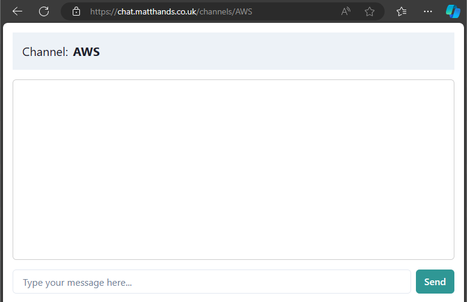

# Appsync-Messaging-App

## Trying it out

Do you want to see the power of Appsync real-time data? [Test this application](https://chat.matthands.co.uk)

## Setup

  1. In order to use Amplify you will need to generate and provide an access token for it to be able to build the frontend. The required scopes are `api`, `read_api` & `read_repository`
  2. When deploying the stack to AWS, it can optionally be configured with a domain in Route53 via the domain params. WAF can also optionally be setup on the GraphQL API.
  3. When the stack you will then need to trigger an Amplify job to build the web frontend similar to what's done in the **`update-frontend`** job in the `.gitlab-ci.yml` file

## Usage  

### From the console

1. Subscribe to receive messages from a channel. E.g. `AWS`

2. Publish a message to that channel

3. Receive that message via the subscription

### From the Website

1. Enter a channel. The website will display a list of example channels but anything following `https://{domain}/channels/{channelName}` will work. Entering a channel will subscribe you to receive messages pushed to that channel

1. When any client pushes messages you that channel. all connected clients will receive it over the subscription.

